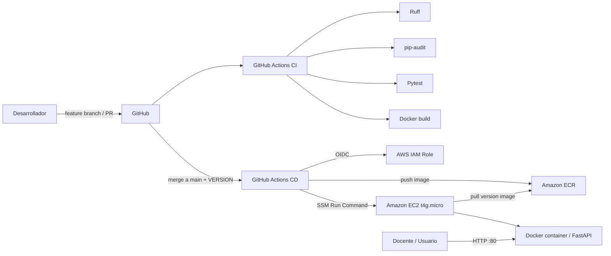

# Arquitectura

```mermaid
flowchart LR
    D[Desarrollador] -->|feature branch / PR| G[GitHub]
    G --> CI[GitHub Actions CI]
    CI --> R[Ruff]
    CI --> A[pip-audit]
    CI --> T[Pytest]
    CI --> B[Docker build]
    G -->|merge a main + VERSION| CD[GitHub Actions CD]
    CD -->|OIDC| IAM[AWS IAM Role]
    CD -->|push image| ECR[Amazon ECR]
    CD -->|SSM Run Command| EC2[Amazon EC2 t4g.micro]
    EC2 -->|pull version image| ECR
    EC2 --> C[Docker container / FastAPI]
    U[Docente / Usuario] -->|HTTP :80| C
```
