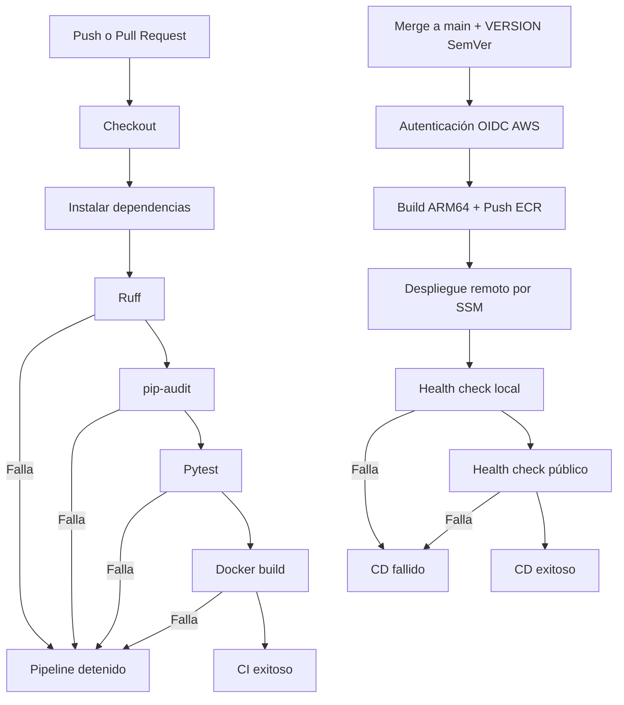

# Pipeline CI/CD

## Disparadores

- CI: `push` a `main`, `feature/**`, `fix/**`, `docs/**` y `pull_request` hacia `main`.
- CD: `push` a `main` después de integrar un Pull Request. La versión se toma de `VERSION` y debe cumplir SemVer `vX.Y.Z`.

## Condiciones de falla

El proceso se detiene si falla análisis estático, auditoría de dependencias, pruebas, construcción de imagen, publicación en ECR, despliegue mediante SSM o health check.
